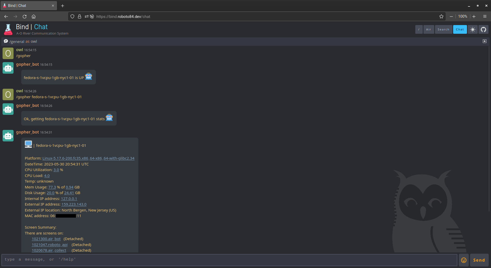

<h1 align="center">gopher_bot</h1>

	

## About
`gopher_bot` is a simple server stats reporting chatbot for the **Wh00t** chat app.

## Usage
To see `gopher_bot` used with **Wh00t** on the `bind_ui` go to the [Bind](https://github.com/roboto84/bind) repo and follow its README.

	

## Commit Conventions
Git commits follow [Conventional Commits](https://www.conventionalcommits.org) message style as explained in detail on their website.

 

    <a href="https://www.flaticon.com/free-icons/beaver" title="beaver icons">
        gopher_bot icon created by Freepik - Flaticon
    </a>

